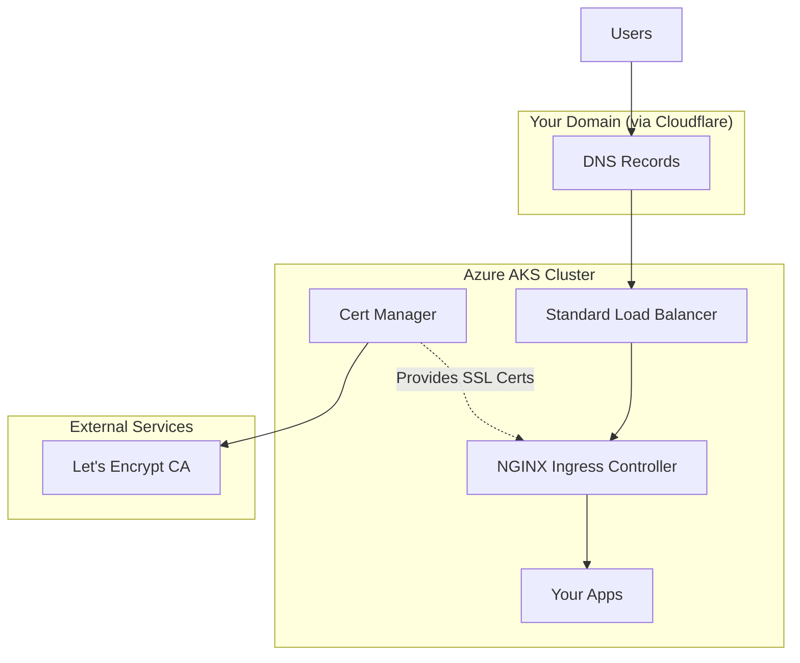

# Azure Kubernetes environment
## 🏗️ What This Project Does

**kube-env** is a cost-optimized Infrastructure as Code (IaC) project that deploys Azure Kubernetes Service (AKS) clusters with automated SSL certificates and DNS management. Perfect for personal projects and small applications that need production-grade infrastructure at reasonable cost.

**Key Benefits:**
- 🔒 **Automatic HTTPS** - Let's Encrypt certificates via cert-manager
- 💰 **Cost Optimized** - ~$53/month for full Kubernetes infrastructure
- 🌐 **DNS Automated** - Cloudflare integration for domain management
- 📦 **Modular Design** - Reusable Terraform modules for easy expansion

## Prerequisites
Ensure the following tools are installed on your machine:

- **Azure CLI**: Used to run az login to connect to your Azure cloud environment.
- **Terraform**: Used to run terraform apply and apply the various environment and application configurations.
- **Kubernetes Command-Line Tool (kubectl)**: Used to connect to the Kubernetes environments and execute the ./scripts.

Ensure that you have created the necessary **storage accounts** and **containers** within those storage accounts. Refer to the 'backend.tf' files for the specific names.

I'm running this project on a Mac. I haven't tested it on Windows. If you do, please ensure the path to your kube-config file is correct.

### Quick Installation

#### Mac Users
Install all prerequisites with Homebrew:
```bash
brew install azure-cli terraform kubectl
```

#### Windows Users
Install with winget (Windows Package Manager):
```powershell
winget install Microsoft.AzureCLI HashiCorp.Terraform Kubernetes.kubectl
```

Or with Chocolatey:
```powershell
choco install azure-cli terraform kubernetes-cli
```

### Optional Tools
- **Helm**: If you want to query additional information about the Helm releases used in this repository.


## 🚀 Quick Start Commands

```bash
# Before any command, please make sure you're logged into azure
# and select a subscription
az login

# Initialize and deploy cost-optimized production cluster
pnpm run kube:init
pnpm run kube:apply

# Deploy an application (Plausible Analytics)
pnpm run app-install:plausible

# Access monitoring tools (if installed)
pnpm run grafana    # Open Grafana dashboard
pnpm run rancher    # Open Rancher management UI
```


## 🛠️ Tech Stack

| Component | Technology | Purpose |
|-----------|------------|---------|
| **Infrastructure** | Terraform + Azure AKS | Kubernetes cluster provisioning |
| **DNS & SSL** | Cloudflare + Let's Encrypt | Domain management and free certificates |
| **Container Management** | Helm + NGINX Ingress | Application deployment and traffic routing |
| **Monitoring** | Grafana + Rancher | Cluster monitoring and management UI |
| **Storage** | Azure Managed Disks | Persistent data for applications |

## 📁 Project Structure

```
kube-env/
├── environments/          # Environment-specific configurations
│   ├── aks-mpn-westeu-prod/     # Cost-optimized production (~$53/month)
│   ├── aks-vse-westeu-prod/     # Standard production environment  
│   └── aks-vse-westeu-dev/      # Development environment
├── apps/                  # Application deployments
│   └── plausible/               # Plausible Analytics deployment
├── modules/              # Reusable Terraform modules
│   ├── azure/                  # Azure-specific modules (AKS, disks)
│   └── helm/                   # Kubernetes app modules (nginx, cert-manager)
├── helm-charts/          # Custom Helm charts
│   └── letsencrypt-cert-issuer/ # SSL certificate configuration
├── scripts/              # Utility scripts
│   ├── grafana-open.sh         # Access monitoring dashboard
│   ├── rancher-open.sh         # Access cluster management UI
│   └── verify-kube-context.sh  # Validate Kubernetes connection
└── package.json          # NPM scripts for easy deployment
```

## 🔄 How It Works



## 🌍 Environments

| Environment | Subscription | Purpose | Monthly Cost |
|-------------|--------------|---------|--------------|
| **aks-mpn-westeu-prod** | Microsoft Partner Network | Cost-optimized production | ~$53 |
| **aks-vse-westeu-prod** | Visual Studio Enterprise | Standard production | ~$70-95 |
| **aks-vse-westeu-dev** | Visual Studio Enterprise | Development/testing | Variable |


### Azure Resource Naming Conventions
I follow this naming convention for my Azure resources:
{resourceType}-{workload/app}-{subscription}-{environment}-{region}-{instance}

- **resourceType**: Use one of the Azure-recommended abbreviations [here](https://learn.microsoft.com/en-us/azure/cloud-adoption-framework/ready/azure-best-practices/resource-abbreviations)
- **subscription**: Indicates one of my two subscriptions::
  - mpn: Microsoft Partner Network
  - vse: Visual Studio Enterprise Subscription

## 🔌 External APIs & Services

### Cloudflare API
- **Purpose:** Automated DNS record creation and domain validation
- **Integration:** Creates DNS records when load balancer IPs are assigned
- **Authentication:** API Token (stored as environment variable)

### Let's Encrypt
- **Purpose:** Free SSL/TLS certificates with automatic renewal
- **Integration:** cert-manager handles the entire certificate lifecycle
- **Validation:** DNS challenge via Cloudflare API

To automatically generate certificates for my ingress controllers, I use the setup detailed in this guide:: https://dev.to/ileriayo/adding-free-ssltls-on-kubernetes-using-certmanager-and-letsencrypt-a1l


### Helm Chart Repositories
- **cert-manager:** `https://charts.jetstack.io`
- **ingress-nginx:** `https://kubernetes.github.io/ingress-nginx`
- **plausible:** `https://imio.github.io/helm-charts`

## 💡 Key Features

### Cost Optimization
- **Burstable VMs** - Standard_B2s instances that scale with demand (~$35/month)
- **Ephemeral OS Disks** - No extra storage costs for system disks
- **Standard Load Balancer** - Required for AKS, single rule setup (~$18/month)  
- **Managed Disks** - Separate persistent storage only where needed

The `aks-mpn-westeu-prod` configuration is optimized for cost efficiency. Here are a few considerations:

- **OS Disk Size (30GB)**: The node uses around 23GB of disk space for system data, leaving approximately 7GB for containers. While this is limited, the low-memory machines used cannot handle many containers anyway. Separate managed disks are created for container data, so it is not stored on the OS disk. Keep this in mind when using large or numerous container images.
- **OS Disk Type (Ephemeral)**: The 30GB limit corresponds to the maximum size of an ephemeral disk included in the VM price. For larger storage needs, you must switch to a "Managed" disk, which will mean additional Azure costs.

### Security & Automation
- **Managed Identities** - No stored credentials in code
- **Automatic SSL** - Let's Encrypt certificates with auto-renewal
- **Network Isolation** - Kubernetes namespaces and Azure network security
- **State Management** - Terraform state stored in Azure with locking

### Developer Experience
- **NPM Scripts** - Simple commands for complex operations
- **Modular Design** - Reusable components for easy expansion
- **Clear Documentation** - Architecture decisions and rationale documented
- **Helper Scripts** - Quick access to monitoring and management tools

## 📊 Applications Included

### Plausible Analytics
- **Purpose:** Privacy-focused web analytics
- **Storage:** PostgreSQL (1GB) + ClickHouse (8GB)
- **Access:** Automatic HTTPS with your domain
- **Backup:** Persistent volumes with Azure Managed Disks

### Management Tools
- **Rancher:** Web-based Kubernetes management interface
- **Grafana:** Infrastructure monitoring and alerting
- **cert-manager:** Automatic SSL certificate management
- **NGINX Ingress:** HTTP/HTTPS traffic routing and load balancing